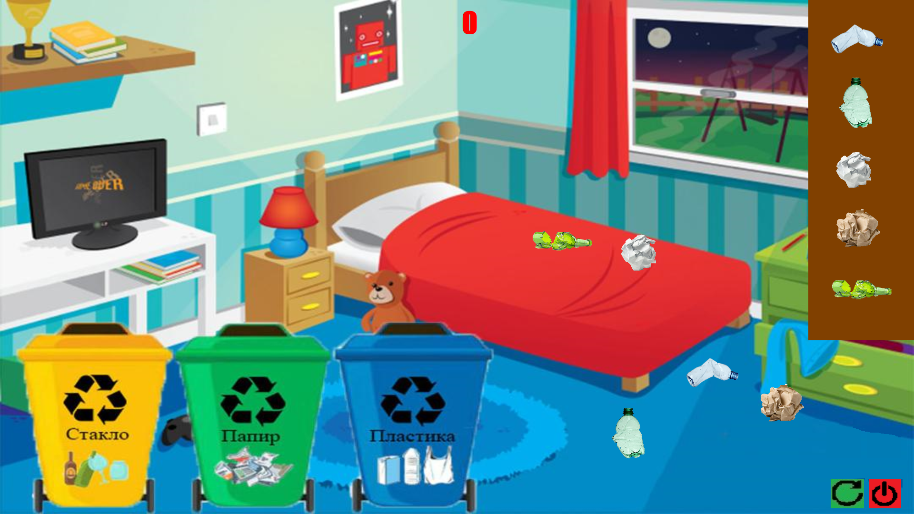

## Introduction

* The faculty received a project to make a game for children, to teach children how to dispose garbage. The game will be launched on the mobile display presented below in the description.

## Used Tehnology

* Windows Forms App
* C#

## Start Application

...\Igrica\bin\Release\net6.0-windows\Igrica.exe

## Some highlights

1. Drag trash into the appropriate bin.

2. Mobile display 

...